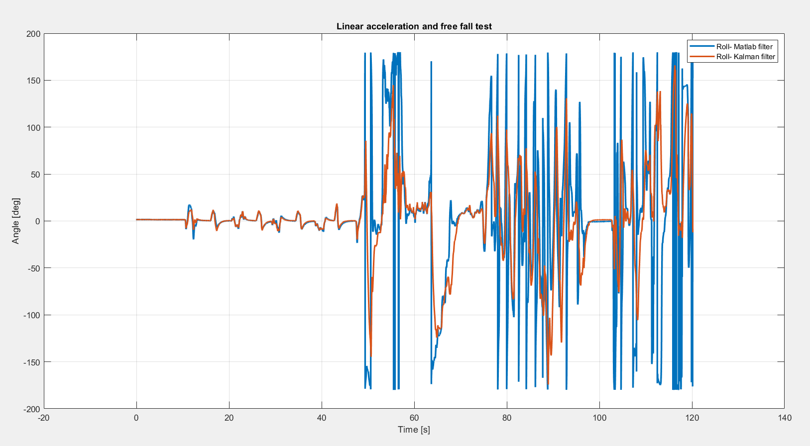
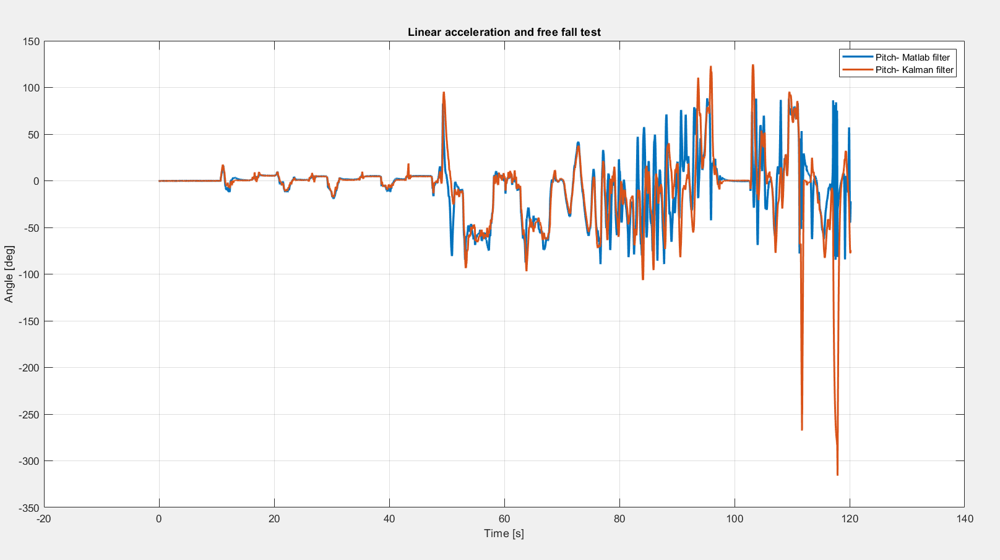

## Experiments
1. Long Flat Test (8 minutes)
- Purpose: check drift, bias and static stability
 Results:
- Kalman: stable, no drift
- EKF: stable, slightly better than Kalman(0.4° closer to Matlab's imufilter)
 Conclusion: Both filters behave correctly in the easiest experiment.

2. Extreme Orientations
- right/left tilt, upward/downward tilt, reverse flat, mixed roll/pitch combinations
 Results:
- Kalman matches imufilter extremely well
- EKF also matches imufilter when tuned properly
- Both filters correctly identify reverse-flat(roll ~180°)
- At pitch ~90°, both filters show roll drift/instability

Why roll becomes unstable at pitch = ±90°
This is a mathematical singularity of Euler angles:
At pitch = ±90°, the rotation sequence loses one degree of freedom
Roll and yaw become coupled
Small noise in yaw → large apparent changes in roll
This is not a filter bug — it’s Euler angle ambiguity
Even MATLAB’s imufilter shows this behavior when converted to Euler angles.

Conclusion: Euler roll is not physically meaningful at ±90° pitch. All filters struggle here because the representation itself breaks.

3. Linear Acceleration & Free Fall(Adversarial Test)
- Purpose: show the limitations of using acc + gyro for tilt
- Scenario: 30 seconds of linear acceleration while keeping device flat
  30 seconds of random fast motion
  10 seconds flat
  Free fall with spin (multiple rotations)
 Results:
Kalman:
- Best matching filter to that of Matlab's
- Tracks spins during free fall
- Because it effectively becomes gyro‑only when accel is invalid

EKF:
- Matches imufilter in dynamic segments
- More noisy when Q is large
- Underestimates angles when Q is small
- Correctness comes at the cost of noise

imufilter:
- Conservative
- Rejects accel when |a| ≠ g
- Does not show multiple spins in free fall (orientation unobservable)

Why all filters fail under strong linear acceleration
Accelerometer measures:
a_measured = g + a_linear
When linear acceleration dominates:
- gravity direction is not observable
- tilt cannot be recovered
- any filter using accel as gravity will be wrong

Why Kalman matches better?
Because atan2(acc) implicitly rejects some linear acceleration, and the KF trusts gyro heavily during motion. It looks right, but it’s not physically correct — it’s just integrating gyro.

## Conclusion:  

This test demonstrates the fundamental limits of acc+gyro fusion and Euler angles. No 2D filter can solve this; you need a 3D quaternion filter with bias estimation to handle dynamics properly.

